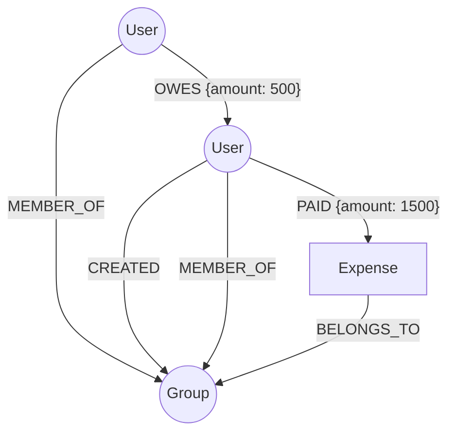

# Cleev: Smart Expense Splitting & Debt Resolution

Cleev is a modern, graph-powered web application designed to eliminate the friction of shared expenses. Whether you're traveling with friends, splitting rent with roommates, or organizing office lunches, Cleev tracks who paid what, precisely calculates who owes whom, and visually resolves complex webs of debt.

## ?? Why a Graph Database?
While traditional expense splitters rely on relational schemas (SQL), representing interpersonal debts as rows in a table quickly becomes a major architectural bottleneck. 

Cleev uses **CognoDB** (a managed graph database using openCypher) because **debts are inherently relational paths, not tabular records.** 

A relational database finds recursive multi-hop relationships awkward and computationally expensive. For example, detecting a "Circular Debt" (Alice owes Bob $10, Bob owes Charlie $10, Charlie owes Alice $10) in SQL requires complex recursive CTEs or multiple application-level roundtrips. In a Graph Database, discovering and resolving these recursive cycles is a first-class citizen—achieved elegantly and performantly in a single pattern-matching Cypher query. The graph naturally maps to the real-world network of human financial interactions.

## ?? Graph Data Model
Our data model revolves around three core nodes: `User`, `Expense`, and `Group`. The relationships natively enforce permissions, membership, and financial ledgers.


* **Nodes**: `User`, `Expense`, `Group`
* **Relationships**: 
  * `[:OWES {amount: float}]` - Represents a rolling ledger balance between two users.
  * `[:PAID {amount: float}]` - Connects a payer to an expense.
  * `[:CREATED]` - Enforces strict ownership & authorization for Groups and Expenses.
  * `[:MEMBER_OF]` & `[:BELONGS_TO]` - Contextual organization.

## ?? Core Cypher Queries Explained

### 1. Multi-Hop Circular Debt Detection (Pathfinding)
This query traverses the graph to find cycles where debts form a loop (e.g., A -> B -> C -> A), which allows the application to automatically cancel out overlapping debts without any real money moving.
```cypher
MATCH path = (u:User)-[r:OWES*2..5]->(u)
WHERE ALL(rel in relationships(path) WHERE rel.amount > 0)
WITH path, 
     [rel in relationships(path) | rel.amount] as amounts,
     nodes(path) as cycleNodes
RETURN 
     [n in cycleNodes | n.name] as participants,
     apoc.coll.min(amounts) as cycleAmount
LIMIT 1
```

### 2. Live Dashboard Aggregation
Instead of caching balances, the dashboard calculates live totals instantly by aggregating the `OWES` edges in both directions.
```cypher
MATCH (u:User {id: $userId})
OPTIONAL MATCH (u)-[r1:OWES]->(owedTo:User)
WITH u, COALESCE(SUM(r1.amount), 0) as youOwe
OPTIONAL MATCH (owedBy:User)-[r2:OWES]->(u)
WITH youOwe, COALESCE(SUM(r2.amount), 0) as youAreOwed
RETURN youOwe, youAreOwed, (youAreOwed - youOwe) as netBalance
```

## ? Application Features & UX
* **Clean, Brutalist UI:** Built with Next.js 15, Tailwind CSS, and Framer Motion for highly interactive, fluid micro-interactions.
* **Resilient States:** Comprehensive empty states, loading spinners, and graceful toast error handling if the database is temporarily unreachable.
* **Strict Authorization:** Graph-level enforcement where only the `[:CREATED]` owner can edit or delete an entity.
* **Live Dashboards:** Real-time balance calculations derived directly from the graph edges.

## ?? Setup & Run Instructions

### 1. Database Setup (CognoDB)
Cleev requires a CognoDB instance to store the graph network.
1. Go to [console.cognodb.com](https://console.cognodb.com/) and create a free account.
2. Provision a free (c0) instance in your preferred region.
3. Save your connection URI (`bolt+s://<instance-id>.databases.cognodb.cloud`) and the generated password for the `cognodb` user.

### 2. Environment Variables
Clone the repository and configure the environment for both the frontend and backend.

**Backend (`backend/.env`):**
```env
PORT=3001
DATABASE_URL=bolt+s://<your-instance>.databases.cognodb.cloud
DATABASE_USER=cognodb
DATABASE_PASSWORD=<your_saved_password>
JWT_SECRET=your_super_secret_jwt_key
```

**Frontend (`frontend/.env.local`):**
```env
NEXT_PUBLIC_API_URL=http://localhost:3001/api
```

### 3. Install & Seed Realistic Data
The repository includes a dedicated seed script that populates the graph with realistic users, groups, expenses, and a complex web of `OWES` relationships.

```bash
# Terminal 1: Backend Setup
cd backend
npm install
npm run seed  # Loads the realistic graph data into CognoDB
npm run dev   # Starts the Express backend on port 3001

# Terminal 2: Frontend Setup
cd frontend
npm install
npm run dev   # Starts the Next.js app on port 3000
```
Navigate to `http://localhost:3000` to explore the application!

## ?? Screenshots
*(Note: Add screenshots of your Dashboard, Group Modal, and Circular Debt resolution screens here before final submission!)*
